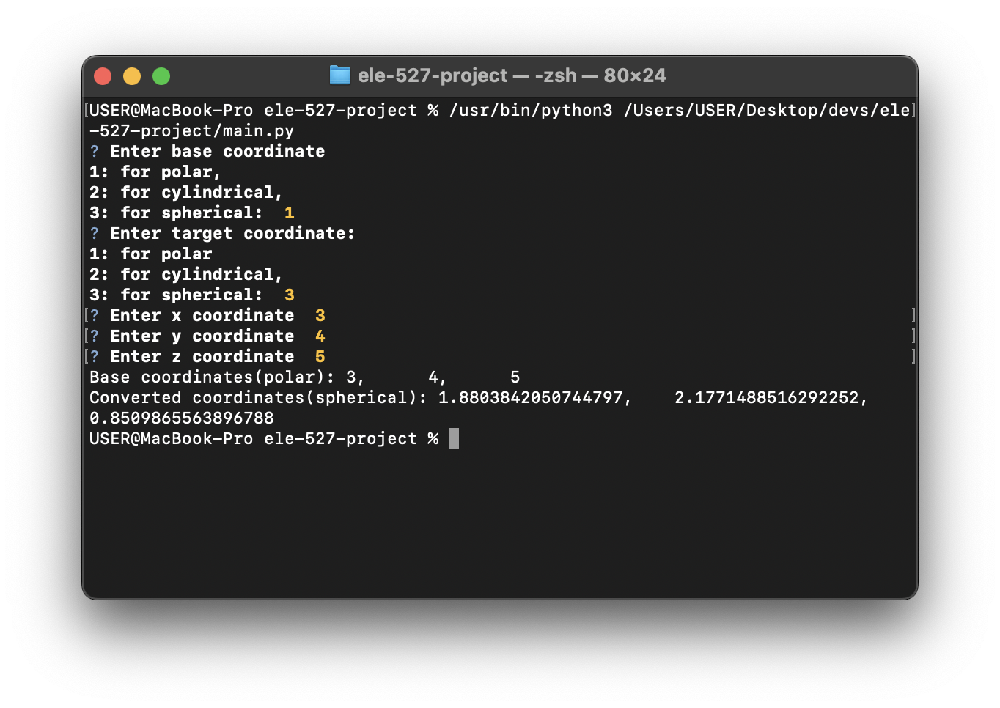

 # ELE 527 Project


- [Description](#description)
- [Authors](#authors)
- [Getting Started](#getting-started)
  - [Dependencies](#dependencies)
  - [Installing](#installing)
  - [Executing program](#executing-program)
- [Documentation](#documentation)
- [License](#license)





## Description

A program that works on the conversion from one coordinate system to another coordinate system using Python commands

## Authors
1. ⁠⁠Adeoye Adefemi Opeoluwa 20181646
2. ⁠⁠Ogundare Victor Olaoluwa 20172709
3. Onabanjo Peter Olamide 20183210
4. ⁠Olorunnishola Kehinde  20181680
5. ⁠⁠Olorunnishola Taiwo  20181681
6. ⁠Adeniyi Imisioluwa 20183115

## Getting Started

### Dependencies

- Python 3.7 or later
- Pip 20.0 or later


### Installing

```
pip install -r requirements.txt
```
### Executing program

- How to run the program
- Step-by-step bullets

```
make run
```

## Documentation
The following dependencies are required 
```shell
pip install "typer[all]"
pip install PyInquirer
pip install rich
```


## License

This project is licensed under the MIT License - see the [LICENSE](./LICENSE) file for details

## Acknowledgments

        